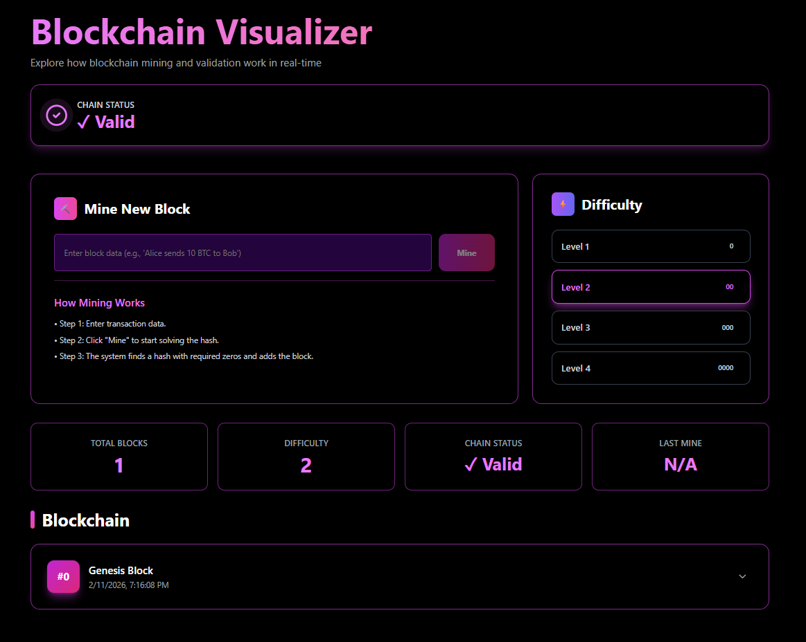

# Blockchain Visualizer

## Project Description
This is a simple Blockchain Visualizer.
It helps users understand how a blockchain works by showing blocks connected in order. 
Each block contains data and is linked to the previous block using a hash.
Users can mine new blocks, change the mining difficulty, and see how long mining takes.
The app also shows whether the blockchain is valid or not when data is changed.

## How to Run Locally
1. pnpm install
2. pnpm run dev
3. Open http://localhost:3000

## Screenshot
